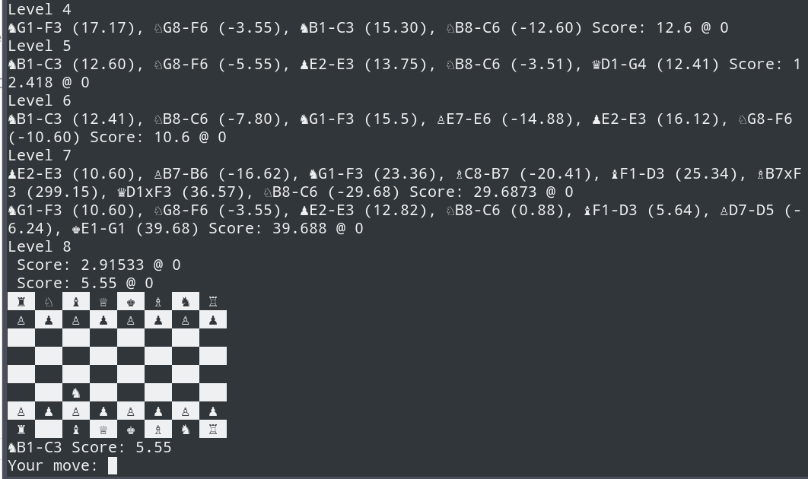

# console-chess
Simplistic chess implementation using only Unicode chess font graphics for testing of reinforcement algorithms

# Dependencies
None. Console font needs to support Unicode characters for chess.

# Build
`console-chess` uses the `cmake` build system:
```bash
mkdir Build
cd Build

cmake ..
make
chess/chess
```

# Sample output

